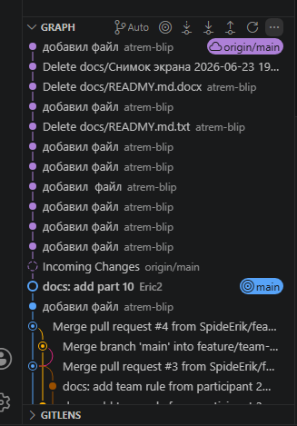
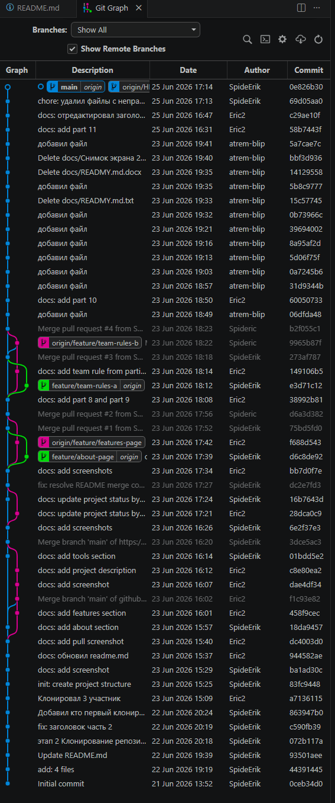

# Практическая работа: совместная разработка проекта на GitHub

## Состав команды
| Участник | GitHub | Роль |
|---|---|---|
| Кожемякин Эрик Романович | SpideErik | Владелец репозитория   И разработчик|
| Карелиг Артем Антонович | artem-blip | Разработчик |
| Кожемякин Эрик Романович | Spideric | Разработчик |

## Цель работы

Увидеть как происходит работа с git в команде (одновременно несколько участников работают над проектом)

## Используемые инструменты
- Git;
- GitHub;
- VS Code.

## Ход работы

### 1. Создание репозитория и добавление участников

1. Добавление участников в репозиторий

3. Ожидание принятия приглашения

4. Приглашение принято

### 2. Клонирование проекта всеми участниками

1. Клонирование участником 1 (владелец репозитория Эрик Кожемякин).
   
   У меня не получилось сделать через gui, поэтому я ввел команду в терминале

2. Клонирование учасником 3 (для ознакомления с процессом приглашения участника с другой стороны я сделал себе еще 1 аккаунт на github)

   Для того что бы на одном PC работать через разные аккаунты я клонировал через ssh

   Настроил локально другого пользователя

### 3. Первый push

Скриншот пуш

### 4. Получение изменений остальными участниками

1. Учатник 3

### 5.  Первая проблема: два участника меняют разные файлы

### 6. Вторая проблема: участник забыл сделать Pull перед работой

#### Описание

Это учебный командный проект для практики GitHub.

#### Используемые инструменты

- Git;
- GitHub;
- VS Code

Скриншот ошибки push

Скриншот нового дерева

### 7. Третья проблема: настоящий merge conflict

#### Статус проекта

Проект находится в активной разработке: команда студентов изучает GitHub, Pull Request и разрешение конфликтов.

#### Проблема: merge conflict
Мы получили конфликт, потому что два участника изменили одну и ту же строку в  README.md. Git не смог автоматически выбрать правильный вариант, поэтому мы  вручную объединили изменения.

### 8. Работа через отдельные ветки

Разными участниками были созданы ветки
- feature/about-page
- feature/features-page

### Часть 9 Pull Request

Создание Pull Request

Review Pull Request

Завершение Pull Request (merge)

### Часть 10. Конфликт внутри Pull Request

### Часть 11. Fetch: посмотреть изменения, но не забирать сразу

#### Разница между Fetch и Pull
Fetch позволяет увидеть, что на GitHub появились новые изменения, но не применяет их сразу к локальным файлам. Pull получает изменения и сразу объединяет их с текущей рабочей версией.

## История коммитов

## Вывод

## Что получилось
- Научились добавлять пользователей к репозиторию на github. 
- Делать pull request, review, merge
- Увидели, что в истории видно кто что менял

## Какие проблемы возникли
- Организационные - внутри каждого этапа можно было работать параллельно и не ждать друг друга, но между этапами нужно было синхронизироваться. Поэтому Эрик Кожемякин создал второго пользователя и работал параллельно в двух разных клонах репозитория от разных пользователей

## Что было самым сложным
- Синхронизировать работу участников между этапами

## Зачем нужны ветки
- От стабильной точки в веткe main можно начать доработку или исправление ошибки при этом не мешать другим участникам.

## Зачем нужен Pull Request
- Чтобы другие участники могли посмотреть и решить можно ли применить изменения в основную ветку

## Почему важно делать Pull перед началом работы
- Чтобы забрать изменения других участников и уменьшить вероятность конфликтов

# Контрольные вопросы
1. Что такое репозиторий?
- База данных для исходников, хранит историю, кто что делал.

2. Чем локальный репозиторий отличается от удаленного?
- Локальный это тот в котором происходит разработка
- Удаленный с которым можно синхронизировать изменения (это могут делать несколько участников)
3. Что делает команда Pull?
- Забирает изменения из удаленного репозитория и применяет в текущую локальную ветку
4. Что делает команда Push?
- Заливает изменения локальной ветки в ветку на удаленный репозиторий
5. Чем Fetch отличается от Pull?
- Fetch только забирает, но не применяет измененния
6. Что такое ветка?
- Подвижный указатель на самый последний коммит в цепочке с именем.
7. Почему не всегда удобно работать сразу в main?
- Чтобы не мешать другим участникам
- В main всегда будет работоспособная версия
8. Что такое Pull Request?
- Запрос другим участникам на mrge в main
9. Зачем нужна проверка Pull Request другим участником?
- Для дополнительной защиты от ошибок
10.Что такое merge conflict?
- Изменения одной и той же области файла одновременно разными участниками, автоматическое слияние невозможно.
11. Почему возникает merge conflict?
- часто, когда забыли сделать pull
12. Как понять, какой вариант кода оставить при конфликте?
- универасльного рецепта нет, иначе бы все происходило автоматически
13. Что будет, если забыть сделать Pull перед началом работы?
- Большая вероятность merge конфликта
14. Почему коммиты должны быть маленькими и понятными?
- Проще найти проблему
- Перемещать между ветками
- Понимать что поменялось
15. Что было самым сложным в этой практической работе?
- Работать в команде

