# team-github-practice
Практическая работа: совместная разработка проекта на GitHub

## Часть 1 (создание репозитория и добавление участников)

1. Добавление участников в репозиторий

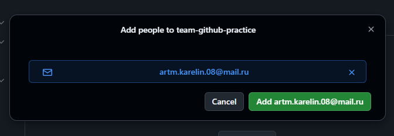

3. Ожидание принятия приглашения

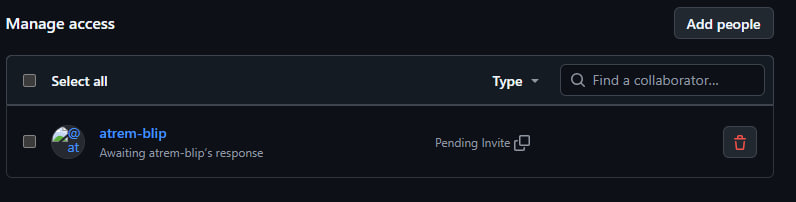

4. Приглашение принято

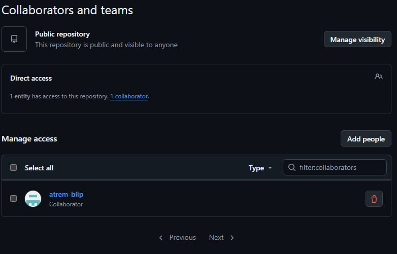

## Часть 2  Клонирование проекта всеми участниками

1. Клонирование участником 1 (владелец репозитория Эрик Кожемякин).
   
   У меня не получилось сделать через gui, поэтому я ввел команду в терминале

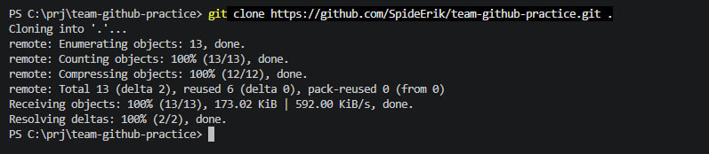

2. Клонирование учасником 3 (для ознакомления с процессом приглашения участника с другой стороны я сделал себе еще 1 аккаунт на github)

   Для того что бы на одном PC работать через разные аккаунты я клонировал через ssh

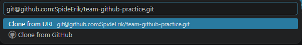

   Настроил локально другого пользователя

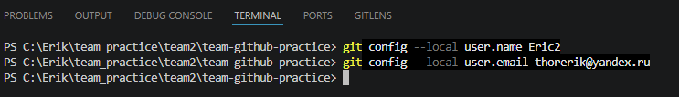

## Часть 3

Скриншот пуш

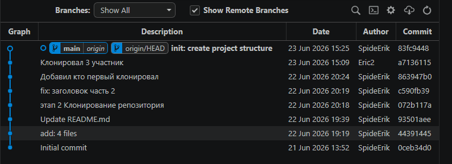

## Часть 4 Получение изменений остальными участниками

1. Учатник 3

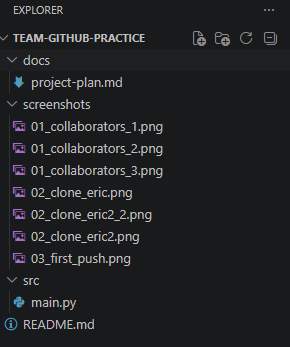

## Часть 5  Первая проблема: два участника меняют разные файлы

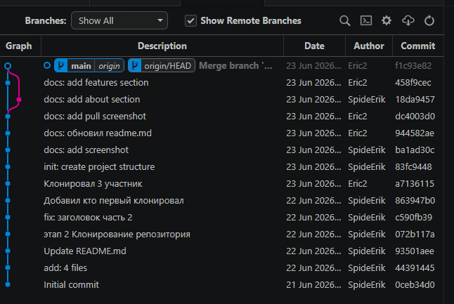

## Часть 6 Вторая проблема: участник забыл сделать Pull перед работой

### Описание

Это учебный командный проект для практики GitHub.

### Используемые инструменты

- Git;
- GitHub;
- VS Code

Скриншот ошибки push

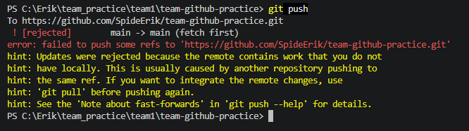

Скриншот нового дерева

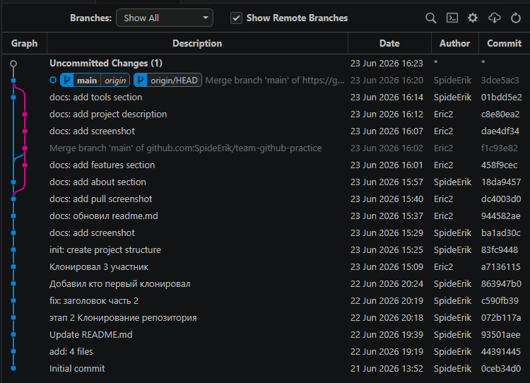

## Часть 7 Третья проблема: настоящий merge conflict

### Статус проекта

Проект находится в активной разработке: команда студентов изучает GitHub, Pull Request и разрешение конфликтов.

### Проблема: merge conflict
Мы получили конфликт, потому что два участника изменили одну и ту же строку в  README.md. Git не смог автоматически выбрать правильный вариант, поэтому мы  вручную объединили изменения.

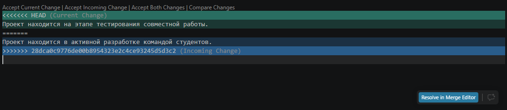

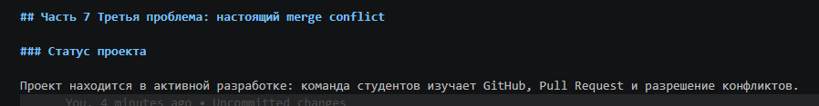

## Часть 8 Работа через отдельные ветки

## Часть 9 Pull Request

Создание Pull Request

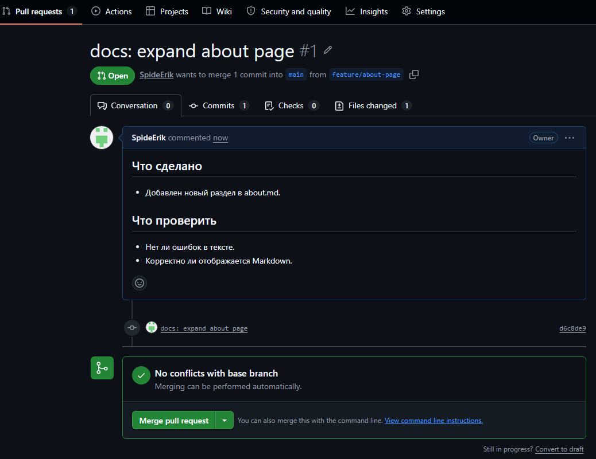

Review Pull Request

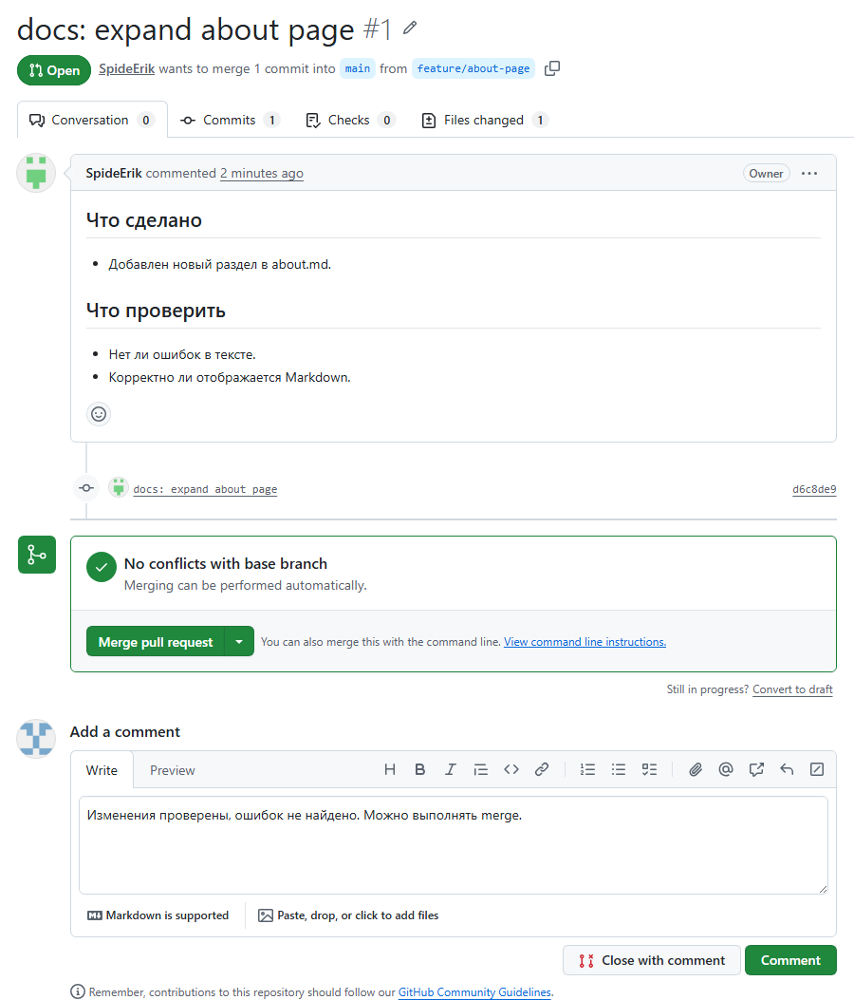

Завершение Pull Request (merge)

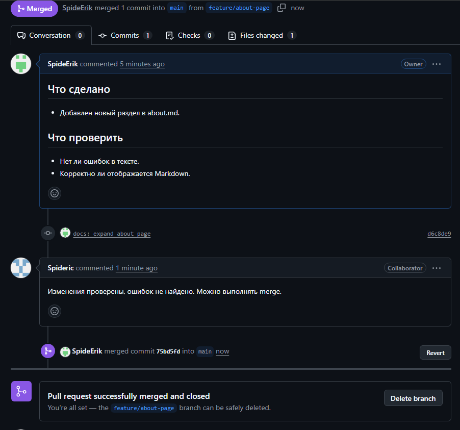

## Часть 10. Конфликт внутри Pull Request

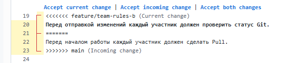

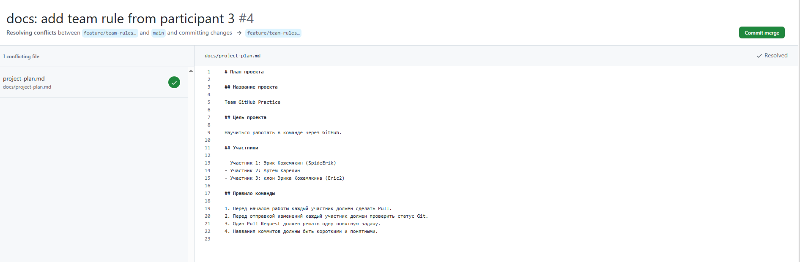
